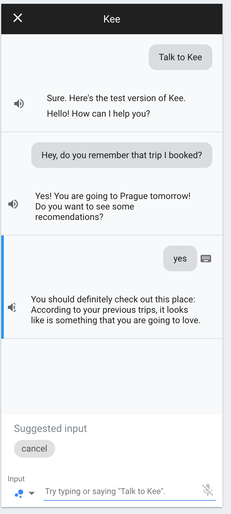

# GTH-London-Pepe
Project submission for the `Global Travel Hackathon in LONDON, by Pepe team`.

**Write one sentence explaining what does your project.**

Kee is a conversational UI travel buddy that assists you every step of the way with personalised suggestions that suit your accessibility needs.

## :books: Description

Conversational UI is the future inside Accesible User Experience field, and that is why we have created a Conversational Buddy that helps the user throughout the whole travelling process.

* The development tools used to build the project;
VSCode
Azure CLI
DialogFlow
Figma

* SDKs used in the project;
* APIs used in the project;
Tequila Search API
* Any assets used in the project;
Pictures and Videos from
* Any libraries used in the project;
CosmosDB Client
* Any components not created at the hackathon;
Orbit components

## :hugs: Maintainers

List all the team members. For example:
* [Mina Barcelo - $USER](https://github.com/$USER)
* [Moises Dominguez - $USER](https://github.com/$USER)
* [Brais Pineiro - $USER](https://github.com/$USER)
* [Samuel Andreo - samuanv](https://github.com/samuanv)

## :tada: Why is this so awesome?

* List reasons why you think your project is awesome.
* Two.
* Etc.

## :hammer_and_wrench: Installation

Cloud Functions will be available for one week at `https://kee-fn.azurewebsites.net`

Please note that these steps can fail because of 1345 different reasons:

- Install https://github.com/Azure/azure-functions-core-tools
- Add `azure/local.settings.json` with `azure/local.settings.sample.json` structure.
- Create a Resource group, a Storage account and a CosmosDB instance.
- Run `func start` to run it in local
- Run `func deploy` to deploy into you azure account.

## :bulb: Devstack
React & Orbit for the client
JavaScript serverless endpoints using Azure Functions for our underlying infrastructure
Azure SignalR for real time communication between functions and client
DialogFlow and Google Assistant for voice recognition and processing
CosmoDB as a cloud database

Three Serverless Functions:
- getAdvices (Post | Get): Triggers and retrives advices
- searchFlight (Get): Connects with Tequila API
- negotiate: Negotiates the best way to do a real time connection (puller, websocket ....)

Client side code inside `/app`;
## :warning: Licence

Any intellectual property developed during and within the scope of the hackathon must be open source and licensed under one of the licenses referenced in https://opensource.org/licenses. We will not have any rights and teams will be the author of their work.

`Example:`

>The code in this project is licensed under MIT license. By contributing to this project, you agree that your contributions will be licensed under its MIT license.
